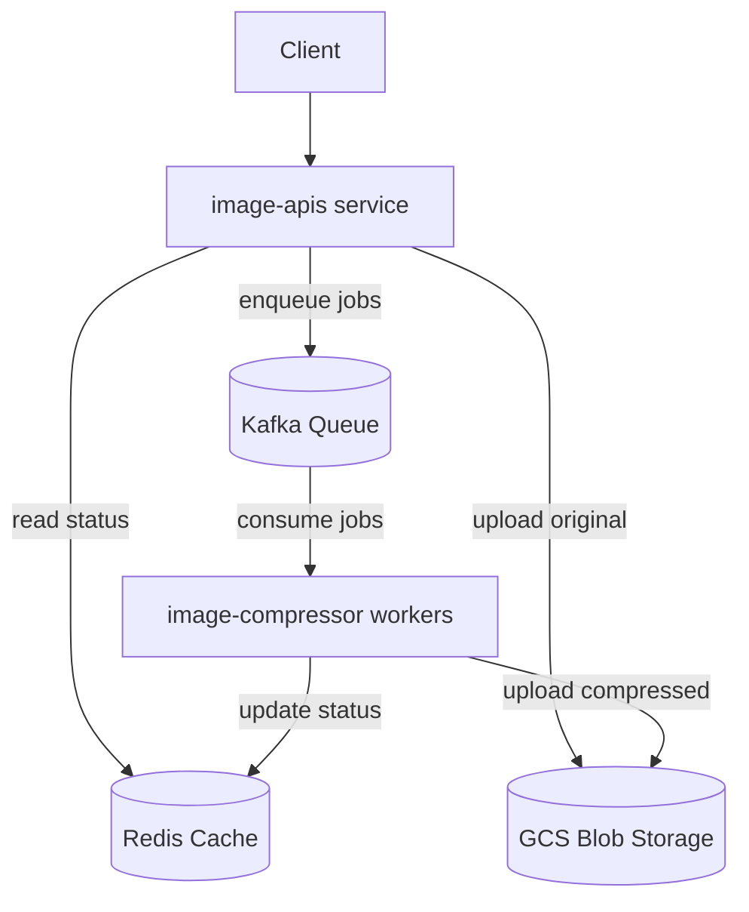

# Imagep backend
*Asynchronous backend microservices; design for scalability and reliability using polling base*
## Background
**[ImageP](https://imagep.zhunismp.dev)** is a website for compressing image inspired by [iloveimage](https://www.iloveimg.com/compress-image). **The main purpose of this project is to implement asynchronous system that handle heavy task like image compressing without crashing when facing the load.**

## Architecture


## Infrastructure
- **Terraform** - manage cloud resource infrastructure
- **ArgoCD** - manage Kubernetes cluster infrastructure
- **GitOps** - CICD workflow from pull request to production

## Pre-requisites
- Go 1.21+
- Docker
- Google Cloud SDK

## How to run locally
### 1. Spinning up dependencies
Run below command to start Kafka and Redis
```
docker compose up -d
```
This command will start with minimal configuration for development
- Kafka
- Kafka DropUI
- Redis
- Redis Insight
### 2. Start image-compressor service
Go into image-compressor folder
```
cd services/image-compressor
```
Start go application by running
```
go run main.go
```
### 3. Start image-apis service
Go into image-apis folder
```
cd services/image-apis
```
Start go application by running
```
go run main.go
```
## Tools
We have spinning up helper tools for inspecting data inside dependencies
- `localhost:9090` - kafka Drop UI for inspect kafka cluster, topic, message, etc.
- `localhost:5540` - Redis insight for inspect data inside redis.